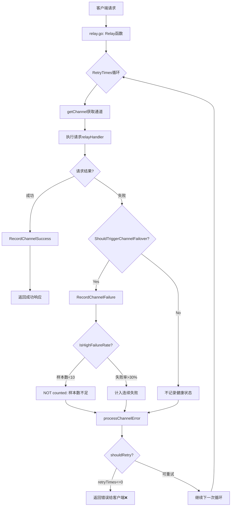

# 通道故障切换机制缺陷分析

## 问题现象

**用户报告**：当上游API返回403并发限制错误时，系统没有自动切换到其他通道，而是直接将错误返回给客户端，导致客户端任务停止。

**错误日志**：
```
[ERR] 2025/11/19 - 15:39:46 | channel error (channel #2, status code: 403): session并发窗口已满. 请耐心等待 1 分钟然后继续
[SYS] 2025/11/19 - 15:39:46 | Channel 2 failure NOT counted: 样本数不足: 1 < 10 (rate=0.00%)
[ERR] 2025/11/19 - 15:39:46 | relay error: session并发窗口已满. 请耐心等待 1 分钟然后继续
[GIN] 2025/11/19 - 15:39:46 | 403 | 835.55315ms | POST /v1/messages?beta=true
```

**关键问题**：
- ❌ 识别了应该触发failover的错误（403+并发限制）
- ❌ 但因为样本数不足（1 < 10），没有计入通道故障
- ❌ 没有尝试切换到其他通道
- ❌ 错误直接返回给客户端（403状态码）

---

## 根本原因分析

### 1. 默认配置问题

**位置**：`common/constants.go:RetryTimes`

```go
var RetryTimes = 0  // ❌ 默认不重试
```

**影响**：
- `RetryTimes=0` 意味着默认情况下不会尝试切换通道
- 即使识别了通道级错误，也不会触发重试机制

### 2. 重试逻辑的阻断点

**位置**：`controller/relay.go:258-298`

```go
func shouldRetry(c *gin.Context, openaiErr *types.NewAPIError, retryTimes int) bool {
    if openaiErr == nil {
        return false
    }
    if types.IsChannelError(openaiErr) {
        return true  // ✅ 通道错误应该重试
    }
    if types.IsSkipRetryError(openaiErr) {
        return false
    }
    if retryTimes <= 0 {  // ❌ 当RetryTimes=0时，这里直接返回false
        return false
    }
    // ... 后续的状态码检查都不会执行
}
```

**问题**：
- 即使前面判断了 `IsChannelError`，但当 `RetryTimes=0` 时
- `retryTimes <= 0` 检查在其他重试条件（429、5xx等）之前
- 导致即使是应该重试的错误，也会被阻断

### 3. 健康追踪的样本数门槛

**位置**：`service/channel_health.go:115-130`

```go
func IsHighFailureRate(channelID int) (isHigh bool, failureRate float64, reason string) {
    totalCount, failureCount := GetWindowStats(channelID)

    // Insufficient sample size
    if totalCount < MinSampleSize {  // MinSampleSize = 10
        // Special handling for low-traffic channels with significant failures
        if failureCount >= LowTrafficMinFailures && totalCount > 0 {
            rate := float64(failureCount) / float64(totalCount)
            if rate > LowTrafficFailureRate {  // 80%
                return true, rate, ...
            }
        }
        return false, 0, fmt.Sprintf("样本数不足: %d < %d", totalCount, MinSampleSize)
    }
    // ...
}
```

**问题**：
- **需要10个样本**才会进行正常的失败率评估
- **低流量特殊处理**需要至少5个失败且失败率>80%
- 对于第1-4个失败请求：直接返回"样本数不足"，不会触发任何保护机制

**影响**：
- 前9个请求的失败不会触发通道暂停或禁用
- 这些失败全部返回给客户端
- 用户体验极差

---

## 完整的错误处理流程追踪

### 请求处理流程



### 当前实现的问题点

#### 场景：首次遇到403并发限制错误

1. **请求失败**
   - 上游返回：`403: session并发窗口已满`
   - 位置：`controller/relay.go:187`

2. **错误识别**
   ```go
   // service/error.go:100-107
   if statusCode == 403 {
       if strings.Contains(errorMessageLower, "并发") ||
          strings.Contains(errorMessageLower, "session") && strings.Contains(errorMessageLower, "已满") {
           return true  // ✅ 识别为应该failover的错误
       }
   }
   ```

3. **记录通道失败**
   ```go
   // controller/relay.go:197-199
   if service.ShouldTriggerChannelFailover(newAPIError.StatusCode, newAPIError.Error()) {
       service.RecordChannelFailure(channel.Id)  // ✅ 调用记录
   }
   ```

4. **健康评估（问题点1）**
   ```go
   // service/channel_health.go:116-130
   totalCount, failureCount := GetWindowStats(channelID)  // totalCount=1, failureCount=1

   if totalCount < MinSampleSize {  // 1 < 10
       return false, 0, "样本数不足: 1 < 10"  // ❌ 不计入失败
   }
   ```

   **结果**：
   ```
   [SYS] Channel 2 failure NOT counted: 样本数不足: 1 < 10 (rate=0.00%)
   ```

5. **重试判断（问题点2）**
   ```go
   // controller/relay.go:203
   if !shouldRetry(c, newAPIError, common.RetryTimes-i) {  // RetryTimes=0, i=0 → retryTimes=0
       break  // ❌ 退出循环，不重试
   }
   ```

   原因：
   ```go
   // controller/relay.go:268
   if retryTimes <= 0 {  // 0 <= 0
       return false  // ❌ 直接返回false
   }
   ```

6. **返回错误给客户端**
   ```go
   // controller/relay.go:86-102
   defer func() {
       if newAPIError != nil {
           c.JSON(newAPIError.StatusCode, ...)  // ❌ 返回403错误
       }
   }()
   ```

---

## 存在的缺陷和风险

### 缺陷1：样本数门槛过高

**问题**：
- 需要10个请求样本才会评估失败率
- 低流量特殊处理也需要5个失败

**风险**：
- 前9个用户请求会全部失败
- 对于低频使用的通道，可能永远不会触发保护机制
- 用户体验差，可能导致客户端任务中断

**影响场景**：
- 并发限制错误（应该立即切换）
- API密钥额度耗尽（前9个请求都会失败）
- 通道临时不可用

### 缺陷2：RetryTimes=0 阻断所有重试

**问题**：
- 默认配置 `RetryTimes=0`
- `shouldRetry` 函数中 `retryTimes <= 0` 检查在其他条件之前
- 即使识别了通道级错误，也不会重试

**风险**：
- 通道故障时不会自动切换
- 降低了系统的容灾能力
- 用户需要手动配置 `RetryTimes>0` 才能获得基本的容灾

### 缺陷3：重试逻辑的检查顺序不合理

**当前顺序**（`controller/relay.go:258-298`）：
```go
func shouldRetry(...) bool {
    if openaiErr == nil { return false }
    if types.IsChannelError(openaiErr) { return true }  // ✅ 通道错误
    if types.IsSkipRetryError(openaiErr) { return false }
    if retryTimes <= 0 { return false }  // ❌ 阻断点
    if _, ok := c.Get("specific_channel_id"); ok { return false }
    if openaiErr.StatusCode == http.StatusTooManyRequests { return true }  // 🚫 不可达
    if openaiErr.StatusCode == 307 { return true }  // 🚫 不可达
    if openaiErr.StatusCode/100 == 5 { return true }  // 🚫 不可达
    // ...
}
```

**问题**：
- `retryTimes <= 0` 检查过早
- 导致后续的 429、5xx 等重试逻辑无法执行

### 缺陷4：并发限制错误应该立即切换

**当前行为**：
- 403并发限制错误被识别为应该failover
- 但仍然需要等待样本数达到10个
- 前9个请求都会因为并发限制失败

**期望行为**：
- 立即切换到其他通道
- 避免用户请求失败

**理由**：
- 并发限制是暂时性的资源不可用
- 等待1分钟不如切换到其他通道
- 提升用户体验和系统可用性

---

## 改进建议

### 建议1：针对特定错误类型立即触发切换

**目标**：对于明确的资源耗尽错误，不等待样本数，立即切换

**修改位置**：
- `service/channel_health.go:RecordChannelFailure`
- `service/error.go:ShouldTriggerChannelFailover`

**实现思路**：
```go
// 在 RecordChannelFailure 中添加立即切换逻辑
func RecordChannelFailure(channelID int, errorCode int, errorMessage string) error {
    // 1. Record to sliding window
    RecordChannelRequest(channelID, false)

    // 2. Check if this is an immediate-failover error
    if ShouldImmediateFailover(errorCode, errorMessage) {
        // 立即暂停通道，不等待样本数
        return suspendChannelImmediately(channelID, "immediate failover")
    }

    // 3. Check if current window shows high failure rate
    isHigh, rate, reason := IsHighFailureRate(channelID)
    // ... 现有逻辑
}

// 新增函数：判断是否应该立即切换
func ShouldImmediateFailover(statusCode int, errorMessage string) bool {
    lowerMsg := strings.ToLower(errorMessage)

    // 并发限制
    if statusCode == 403 && (
        strings.Contains(lowerMsg, "并发") ||
        strings.Contains(lowerMsg, "session") && strings.Contains(lowerMsg, "已满") ||
        strings.Contains(lowerMsg, "concurrency")) {
        return true
    }

    // API密钥失效
    if statusCode == 401 && (
        strings.Contains(lowerMsg, "invalid") ||
        strings.Contains(lowerMsg, "expired")) {
        return true
    }

    // 额度耗尽
    if strings.Contains(lowerMsg, "insufficient_quota") ||
       strings.Contains(lowerMsg, "quota exceeded") {
        return true
    }

    return false
}
```

**优点**：
- 特定错误立即切换，不影响用户
- 保留样本数机制用于检测渐进性故障
- 提升用户体验

### 建议2：调整默认RetryTimes值

**当前**：`RetryTimes = 0`

**建议**：`RetryTimes = 2`

**理由**：
- 提供基本的容灾能力
- 与现有的优先级机制配合
- 大多数系统默认都会有重试机制

**影响**：
- 向后兼容性：需要在发版说明中告知用户
- 性能影响：失败请求会增加最多2次重试（可接受）

### 建议3：优化shouldRetry检查顺序

**建议顺序**：
```go
func shouldRetry(...) bool {
    if openaiErr == nil { return false }

    // 优先检查是否明确不重试
    if types.IsSkipRetryError(openaiErr) { return false }

    // 通道级错误应该重试（不受RetryTimes限制）
    if types.IsChannelError(openaiErr) { return true }

    // 特定通道指定不重试
    if _, ok := c.Get("specific_channel_id"); ok { return false }

    // RetryTimes限制检查移到后面
    if retryTimes <= 0 { return false }

    // 状态码判断
    if openaiErr.StatusCode == http.StatusTooManyRequests { return true }
    if openaiErr.StatusCode == 307 { return true }
    if openaiErr.StatusCode/100 == 5 {
        if openaiErr.StatusCode == 504 || openaiErr.StatusCode == 524 {
            return false
        }
        return true
    }
    // ...
}
```

**优点**：
- 通道级错误不受 `RetryTimes` 限制
- 保留了对客户端错误的控制
- 逻辑更清晰

### 建议4：降低样本数门槛或使用动态阈值

**方案A：降低固定阈值**
```go
const MinSampleSize = 5  // 从10降低到5
```

**方案B：动态阈值**
```go
func GetDynamicMinSampleSize(channelID int) int {
    // 根据通道流量动态调整
    // 高流量通道：10个样本
    // 低流量通道：3个样本
}
```

**权衡**：
- 降低阈值：减少用户失败次数，但可能误判
- 动态阈值：更精确，但实现复杂度高

### 建议5：提供手动触发切换的API

**用途**：
- 管理员发现通道故障时可以手动触发切换
- 不等待自动检测机制

**实现**：
```go
// POST /api/channel/:id/failover
func TriggerChannelFailover(c *gin.Context) {
    channelID := ...
    reason := c.Query("reason")

    err := service.SuspendChannelImmediately(channelID, reason)
    // ...
}
```

---

## 总结

### 核心问题

1. **样本数门槛过高**：需要10个样本，导致前9个请求失败
2. **默认不重试**：`RetryTimes=0` 阻断所有重试
3. **检查顺序不合理**：`retryTimes <= 0` 过早检查
4. **缺乏立即切换机制**：并发限制等明确错误应立即切换

### 建议优先级

| 优先级 | 建议 | 影响 | 实现难度 |
|-------|------|------|----------|
| **P0** | 添加立即切换机制 | 高 | 中 |
| **P0** | 调整RetryTimes默认值 | 高 | 低 |
| **P1** | 优化shouldRetry检查顺序 | 中 | 低 |
| **P2** | 降低样本数门槛 | 中 | 低 |
| **P3** | 提供手动触发API | 低 | 中 |

### 快速修复方案

**对于当前用户**：
1. 在配置文件中设置 `RetryTimes=2`
2. 建议设置多个通道作为备份

**对于系统改进**：
1. 实现立即切换机制（建议1）
2. 修改默认 `RetryTimes=2`（建议2）
3. 优化 `shouldRetry` 检查顺序（建议3）

---

## 附录：相关代码位置

| 文件 | 行号 | 功能 |
|------|------|------|
| `common/constants.go` | 变量RetryTimes | 默认重试次数 |
| `controller/relay.go` | 160-206 | 主重试循环 |
| `controller/relay.go` | 258-298 | shouldRetry函数 |
| `service/error.go` | 59-165 | ShouldTriggerChannelFailover |
| `service/channel_health.go` | 115-148 | IsHighFailureRate |
| `service/channel_health.go` | 150-202 | RecordChannelFailure |

---

**文档创建时间**：2025-11-19
**分析人**：Claude Code
**版本**：v1.0
